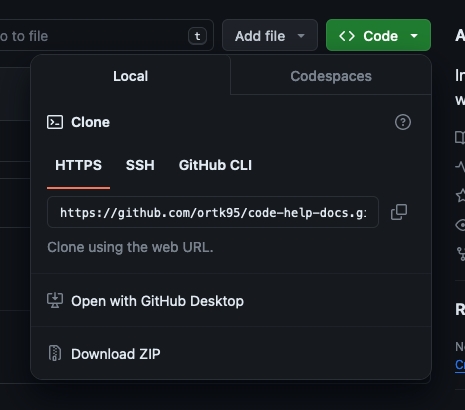
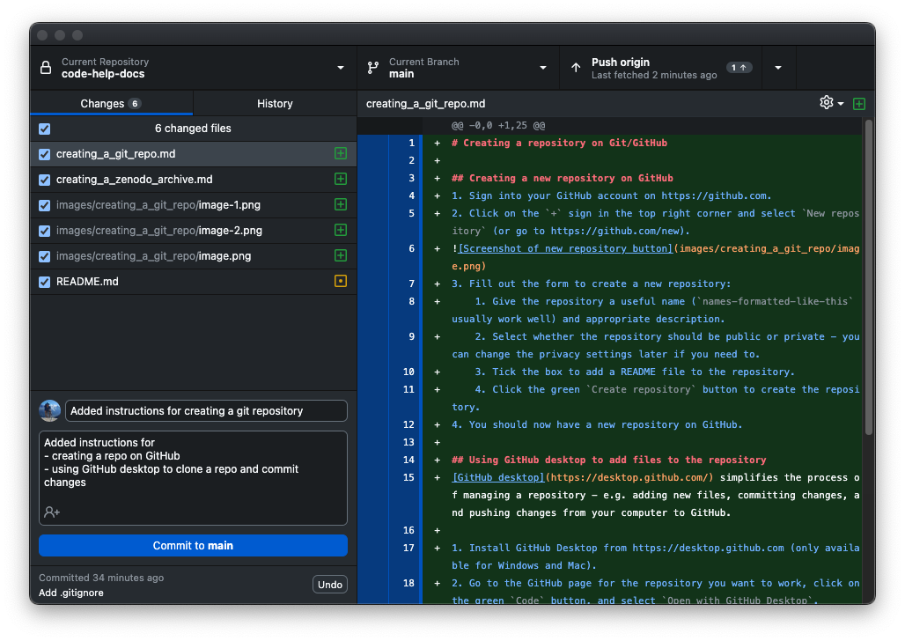

# Creating a repository on Git/GitHub

## Creating a new repository on GitHub
1. Sign into your GitHub account on https://github.com.
2. Click on the `+` sign in the top right corner and select `New repository` (or go to https://github.com/new).
   
    

3. Fill out the form to create a new repository:
    1. Give the repository a useful name (`names-formatted-like-this` usually work well) and appropriate description.
    2. Select whether the repository should be public or private - you can change the privacy settings later if you need to.
    3. Tick the box to add a README file to the repository.
    4. Click the green `Create repository` button to create the repository.
4. You should now have a new repository on GitHub.

[GitHub's quickstart for repositories documentatiton](https://docs.github.com/en/repositories/creating-and-managing-repositories/quickstart-for-repositories)

## Using GitHub desktop to add files to the repository
[GitHub desktop](https://desktop.github.com/) simplifies the process of managing a repository - e.g. adding new files, committing changes, and pushing changes from your computer to GitHub.

1. Install GitHub Desktop from https://desktop.github.com (only available for Windows and Mac).
2. Go to the GitHub page for the repository you want to work, click on the green `Code` button, and select `Open with GitHub Desktop`. 
   
    

3. Choose the location on your computer where you want to store the repository and click `Clone`.
4. You should now have a clone of the repository on your computer. You can add and edit files in this local clone as usual.
5. When you want to create a new commit (e.g. after adding new files or making edits), open the GitHub desktop app:
    1. You should see a list of changes you have made since the last commit. You can select which changes to include in the commit with the tick boxes.
    2. Add a useful commit summary message and description.
    3. Click the `Commit to main` button to create the commit and save the changes to your local clone. Your changes are now saved in your local clone, but not yet on GitHub.
   
        

6. To push the changes to GitHub, click the `Push origin` button in the top right corner of the GitHub desktop app. This will upload your changes to the GitHub repository.

    


## Using `.gitignore` files to automatically exclude files from the repository
`.gitignore` files can be used to automatically exclude certain files from being added to the repository. This is useful to simplify the process of adding files to the repository and to avoid accidentally adding files that don't need to be shared.

To do this, you simply need to create a file called `.gitignore` in the root directory of the repository. This file should contain a list of file paths or patterns to include/exclude from the repository. For example, the following `.gitignore` file will exclude all files with the `.log` extension and all files in the `temp` directory from the repository:

```gitignore
*.log
temp/
```

or this `.gitignore` file will exclude everything by default, and only include Python, Markdown and FITS files:

```gitignore
# Ignore everything by default
*

# Only allow directories and specific filetypes
!*/
!*.md
!*.py
!*.fits

# Allow specific files
!.gitignore
```

[GitHub's `.gitignore` documentation](https://docs.github.com/en/get-started/getting-started-with-git/ignoring-files)