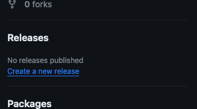
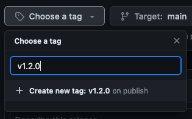
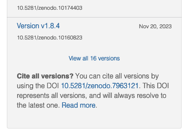
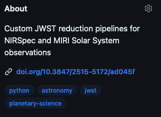
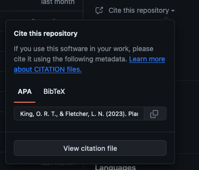

# Creating and updating Zenodo archives

## Linking a GitHub repository to Zenodo
1. [Create a repository on GitHub](creating_a_git_repo.md) to store the code and data you want to archive. [See below](#useful-documentation-to-include-in-the-repository) for some useful information to include in the repository.
2. Make sure the GitHub repository's visibility is public. To change this, go to the repository's settings page on GitHub, scroll to the bottom of the "General" settings section, and change the visibility to public.
3. Create account on https://zenodo.org/ (signing up with GitHub will make things easy).
4. Go to the Zenodo GitHub settings page: https://zenodo.org/account/settings/github/.
5. Click on the switch next to the repository you want to link to Zenodo to turn on archiving for that repository. The repository is now linked to Zenodo and will be automatically archived whenever you create a new release is created on GitHub. If your repository isn't in the list, try clicking the `Sync now` button at the top of the page to refresh the list of repositories, and double check that your repository is public.
6. Create a new release of the repository on GitHub ([see below](#creating-a-new-release-on-github)).
7. Once you have created your first release, Zenodo will automatically create an archive of the repository and assign it a DOI ([see below](#getting-the-zenodo-archive-dois)). 

[GitHub's Zenodo documentation page](https://docs.github.com/en/repositories/archiving-a-github-repository/referencing-and-citing-content)


## Creating a new release on GitHub
Zenodo only creates a new archive when a new release is created on GitHub. To create a new release:

1. Go to the repository's page on GitHub.
2. Click on `Releases` on the right hand side of the repository's page.
   
    

3. Click on the `Draft a new release` button at the top of the page, then fill out the form to create a new release:
    1. Click `Choose a tag`, then type in the text box to create a new tag for the release, then click `Create new tag: ... on publish`. Tags are used to identify specific versions of the repository, and are generally short numerical strings. For example, you could use `v1`, `v2`, `v3`... for each subsequent release. For more detailed versioning, especially for software, [semantic versioning](https://semver.org/) is a good standard to follow (e.g. using tags like `v1.0.0`, `v2.3.4`).

        

    2. Add a useful title and description for the release. This should include a summary of the changes made in this release, and any other relevant information for users of the repository.
    3. Click `Publish release` to create the release. 
4. You should now have a new release of the repository on GitHub, and this will trigger a new archive on Zenodo (assuming the [repository is linked to Zenodo correctly](#linking-a-github-repository-to-zenodo)).


## Getting the Zenodo archive DOIs
Once you have created a new release on GitHub, Zenodo will automatically create an archive of the repository and assign it a permanent DOI. Each release has an individual DOI, and an additional DOI is assigned to the entire repository (which will always point to the latest release). [See the Zenodo documentation](https://zenodo.org/help/versioning) for choosing which DOI version to use.

To find the DOI of an specific release, go to https://zenodo.org/account/settings/github, then click on the appropriate repository for a list of all the releases and their DOIs. These release specific DOIs are useful to cite the exact state of the repository at a specific time.

To find the DOI of the entire repository, go to the Zenodo archive page for the for one of the repository's release (e.g. by clicking on a specific release's DOI). On the right hand side of the page, there will be a list of versions, and below that there will be a DOI to "Cite all versions". This DOI will always point to the latest release of the repository, and is useful to cite the repository as a whole.



To get a nice looking DOI badge for your repository (like the one below), you can use the following markdown code, and just replace the `000000` parts with the appropriate DOIs for your repository. You can then add the markdown code to your `README.md` file to display the badge on GitHub.

```markdown
[](https://doi.org/10.5281/zenodo.000000)
```

[](https://doi.org/10.5281/zenodo.10671792)


## Useful documentation to include in the repository
When creating and updating the repository, it is a good idea to include useful documentation to help users understand the repository and how to use it.

The most important thing to include is a `README.md` file in the root directory of the repository, as this is the first thing users will see when they visit the repository on GitHub ([click here](https://github.com/JWSTGiantPlanets/saturn-atmosphere-miri) for an example.). This file should generally contain:
- The full reference of the paper, including a link to the paper's DOI once published.
    - It can also be useful to add the BibTex citation for the paper, so that users can easily cite the paper in their own work ([click here](https://github.com/ortk95/planetmapper/blob/63ddedc87e0298ef0896ed71b2894370f70cf2a1/README.md?plain=1#L37-L50) for an example).
- A description of the repository, its contents, and how to use it.
- The DOI of the Zenodo archive - this can be included as the nice looking Zenodo badge ([see above](#getting-the-zenodo-archive-dois)).
- Links to any other relevant archives/repositories.

A well written `README.md` is usually sufficient to document the repository, but you can also add other documentation if you think it would be useful...

To customise the description, website and topics of the repository, click on the gear icon in the top right corner of the repository's GitHub page. The description and topics help to describe the repository and make it easier for other people to find and use. The website can be a useful place to put a link to the paper.



If you would like the Zenodo archive to automatically have the correct information (author list, title, links to the paper etc.), you can add a `.zenodo.json` file to the root directory of the repository. See the [Zenodo documentation](https://developers.zenodo.org/#add-metadata-to-your-github-repository-release) for more information about creating a `.zenodo.json` file, and [click here](https://github.com/ortk95/planetmapper/blob/main/.zenodo.json) for an example `.zenodo.json` file.

You can also include a `CITATION.bib` file to let GitHub know how to automatically cite the repository. This file should contain the BibTex citation for the repository, and will automatically add information about the citation to the repository's GitHub page. See the [GitHub documentation](https://docs.github.com/en/repositories/managing-your-repositorys-settings-and-features/customizing-your-repository/about-citation-files) for more details.



If you other people are likely to be using or contributing to the repository, particularly if it contains software, it can be useful to add `LICENSE`, `CONTRIBUTING` and `CODE_OF_CONDUCT` files to the repository. [Click here](https://github.com/ortk95/planetmapper/) for an example.   
